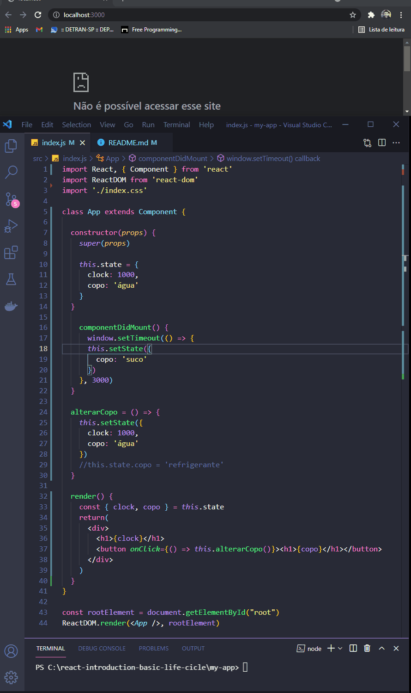

<h1 align="center">
  
   
  ReactJS - Basic State, Proprities e Create Class
</h1>

<h3 align="justify">
Didactic demonstration Basic State, Proprities e Create Class. Credits for the Digital Innovation One JavaScript ES6 Advanced module.
</h3>

 

## 📷 Demonstration

<h4 align="left"> ReactJS - Basic State, Proprities e Create Class </h4>
  

 

## 🚀 Technologies

This project was developed with the following technologies:

- ReactJS
- JavaScript ES6
- Nodejs

 

## ⚙ Commands
- npx create-react-app my-app
- cd my-app
- yarn start
- http://localhost:3000
- import from

## ⚙ Sources
- https://pt-br.reactjs.org/docs/create-a-new-react-app.html

 

---

Made with 💜 by Rafael Maciel
